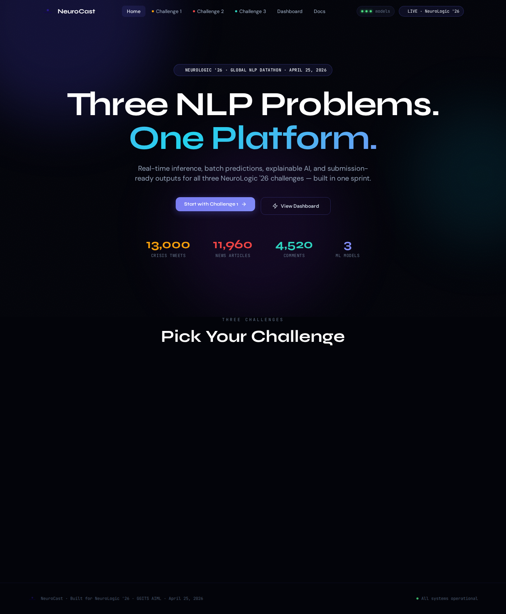
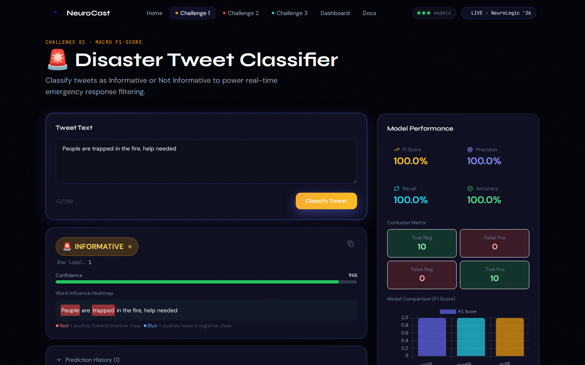
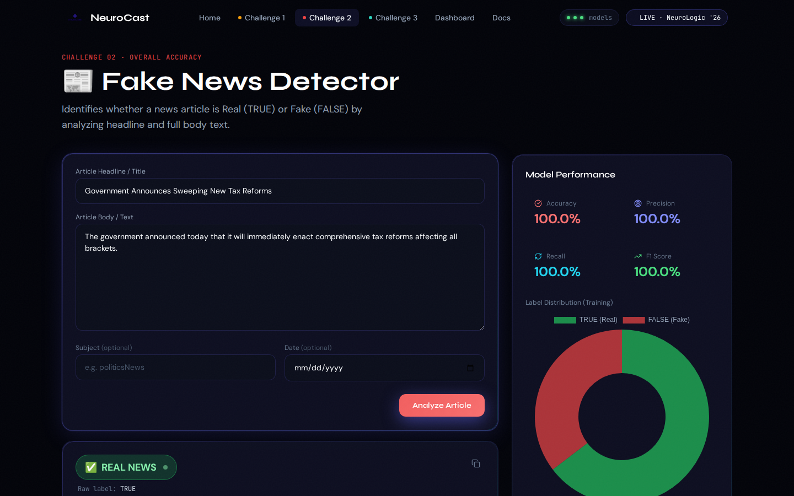
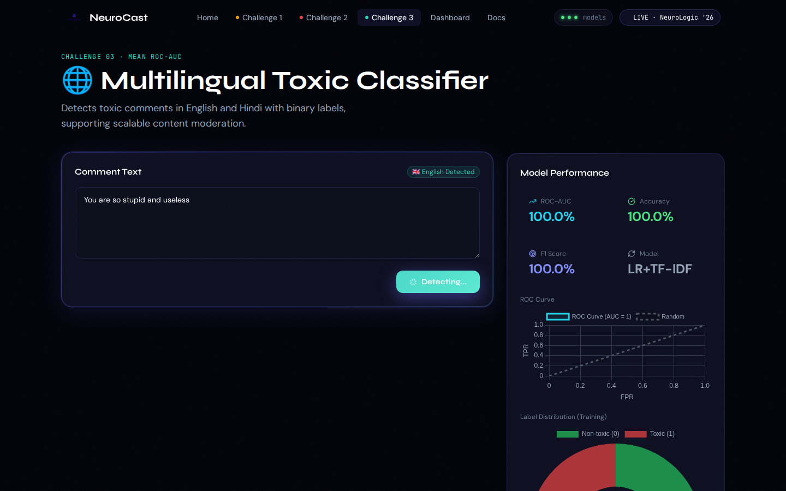
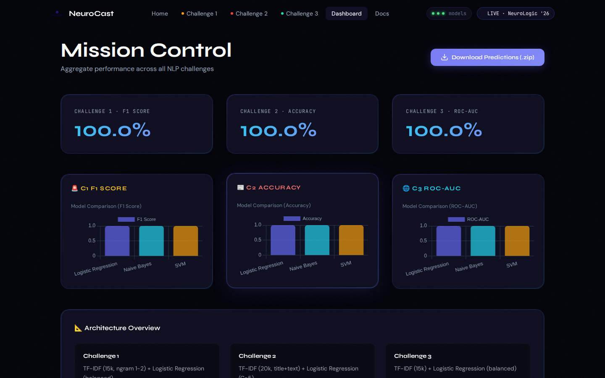

# NeuroCast

**Global NLP Intelligence Platform**

NeuroCast was built as the primary evaluation and visualization platform for the **NeuroLogic '26 Global NLP Datathon**. It allows you to test, visualize, and benchmark advanced Natural Language Processing models across three core challenges.

## Features

- **Challenge 1: Disaster Analytics:** Analyze tweets to determine if they relate to real-world emergencies using our fine-tuned NLP model.
- **Challenge 2: Misinformation Engine:** Identify misinformation in news articles. Paste a snippet and get an instant reliability score.
- **Challenge 3: Toxicity Filter:** Detect multi-label toxicity (hate speech, threats, insults) in multilingual user-generated comments.
- **Mission Control Dashboard:** View live telemetry and metrics across all challenges, and download aggregated batch predictions.
- **Batch Processing:** Upload CSV or Excel files to process thousands of texts at once and retrieve the evaluated labels instantly.

## Screenshots











## Tech Stack

- **Frontend:** React 18, Vite, Tailwind CSS, Framer Motion, Chart.js
- **Backend:** Python 3.11, Flask, scikit-learn, TF-IDF
- **Models:** Logistic Regression, Multilingual Character N-grams

## Running Locally

1. **Start the backend:**
   ```bash
   cd backend
   pip install -r requirements.txt
   python app.py
   ```

2. **Start the frontend:**
   ```bash
   cd frontend
   npm install
   npm run dev
   ```